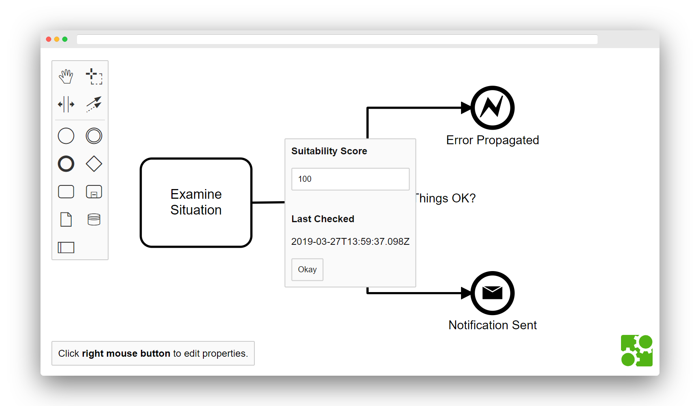

# bpmn-js Example: Model Extension

An example of creating a model extension for [bpmn-js](https://github.com/bpmn-io/bpmn-js). Model extensions allow you to read, modify and write BPMN 2.0 diagrams that contain extension attributes and elements.

:notebook: You can find a more complex example that includes creating a model extension [here](https://github.com/bpmn-io/bpmn-js-example-custom-elements).

:notebook: For more examples of customizing elements head over to our examples [bpmn-js-examples](https://github.com/bpmn-io/bpmn-js-examples/tree/master/custom-elements).


## About

This example allows you to read, modify and write BPMN 2.0 diagrams that contain `qa:suitable` extension attributes and `qa:analysisDetails` extension elements. You can set the suitability score of each element.



Here's an example of a diagram:

```xml
<?xml version="1.0" encoding="UTF-8"?>
<bpmn2:definitions xmlns:xsi="http://www.w3.org/2001/XMLSchema-instance"
                   xmlns:bpmn2="http://www.omg.org/spec/BPMN/20100524/MODEL"
                   xmlns:bpmndi="http://www.omg.org/spec/BPMN/20100524/DI"
                   xmlns:dc="http://www.omg.org/spec/DD/20100524/DC"
                   xmlns:di="http://www.omg.org/spec/DD/20100524/DI"
                   xmlns:qa="http://some-company/schema/bpmn/qa"
                   targetNamespace="http://activiti.org/bpmn"
                   id="ErrorHandling">
  <bpmn2:process id="Process_1">
    <bpmn2:task id="Task_1" name="Examine Situation" qa:suitable="0.7">
      <bpmn2:outgoing>SequenceFlow_1</bpmn2:outgoing>
      <bpmn2:extensionElements>
        <qa:analysisDetails lastChecked="2015-01-20" nextCheck="2015-07-15">
          <qa:comment author="Klaus">
            Our operators always have a hard time to figure out, what they need to do here.
          </qa:comment>
          <qa:comment author="Walter">
            I believe this can be split up in a number of activities and partly automated.
          </qa:comment>
        </qa:analysisDetails>
      </bpmn2:extensionElements>
    </bpmn2:task>
    ...
  </bpmn2:process>
  <bpmndi:BPMNDiagram id="BPMNDiagram_1">
    ...
  </bpmndi:BPMNDiagram>
</bpmn2:definitions>
```

Check out the entire diagram [here](resources/diagram.bpmn).

### Creating a Model Extension

Our extension of BPMN 2.0 will be defined in a JSON file:

```json
{
  "name": "QualityAssurance",
  "uri": "http://some-company/schema/bpmn/qa",
  "prefix": "qa",
  "xml": {
    "tagAlias": "lowerCase"
  },
  "types": [
    {
      "name": "AnalyzedNode",
      "extends": [
        "bpmn:FlowNode"
      ],
      "properties": [
        {
          "name": "suitable",
          "isAttr": true,
          "type": "Float"
        }
      ]
    },
    {
      "name": "AnalysisDetails",
      "superClass": [ "Element" ],
      "properties": [
        {
          "name": "lastChecked",
          "isAttr": true,
          "type": "String"
        },
        {
          "name": "nextCheck",
          "isAttr": true,
          "type": "String"
        },
        {
          "name": "comments",
          "isMany": true,
          "type": "Comment"
        }
      ]
    },
    ...
  ],
  ...
}
```

Check out the entire extension [here](resources/qa.json).

A few things are worth noting here:

* You can extend existing types using the `"extends"` property.
* If you want to add extension elements to `bpmn:ExtensionElements` they have to have `"superClass": [ "Element" ]`.

For more information about model extensions head over to [moddle](https://github.com/bpmn-io/moddle).

Next, let's add our model extension to bpmn-js.


### Adding the Model Extension to bpmn-js

When creating a new instance of bpmn-js we need to add our model extension using the `moddleExtenions` property:

```javascript
import BpmnModeler from 'bpmn-js/lib/Modeler';

import qaExtension from '../resources/qaPackage.json';

const bpmnModeler = new BpmnModeler({
  moddleExtensions: {
    qa: qaExtension
  }
});
```

Our model extension will be used by [bpmn-moddle](https://github.com/bpmn-io/bpmn-moddle) which is part of bpmn-js.

### Modifying Extension Attributes and Elements

bpmn-js can now read, modify and write extension attributes and elements that we defined in our model extension.

After importing a diagram you could for instance read `qa:AnalysisDetails` extension elements of BPMN 2.0 elements:

```javascript
function getExtensionElement(element, type) {
  if (!element.extensionElements) {
    return;
  }

  return element.extensionElements.values.filter((extensionElement) => {
    return extensionElement.$instanceOf(type);
  })[0];
}

const businessObject = getBusinessObject(element);

const analysisDetails = getExtensionElement(businessObject, 'qa:AnalysisDetails');
```

In our example we can set the suitability score of each element:

```javascript
const suitabilityScoreEl = document.getElementById('suitability-score');

const suitabilityScore = Number(suitabilityScoreEl.value);

if (isNaN(suitabilityScore)) {
  return;
}

const extensionElements = businessObject.extensionElements || moddle.create('bpmn:ExtensionElements');

let analysisDetails = getExtensionElement(businessObject, 'qa:AnalysisDetails');

if (!analysisDetails) {
  analysisDetails = moddle.create('qa:AnalysisDetails');

  extensionElements.get('values').push(analysisDetails);
}

analysisDetails.lastChecked = new Date().toISOString();

const modeling = bpmnModeler.get('modeling');

modeling.updateProperties(element, {
  extensionElements,
  suitable: suitabilityScore
});
```

Check out the entire code [here](app/app.js).

## Run the Example

You need a [NodeJS](http://nodejs.org) development stack with [npm](https://npmjs.org) installed to build the project.

To install all project dependencies execute

```sh
npm install
```

To start the example execute

```sh
npm start
```

To build the example into the `public` folder execute

```sh
npm run all
```


## License

MIT